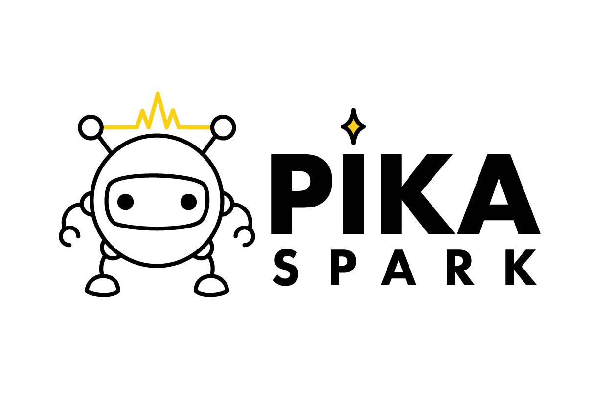
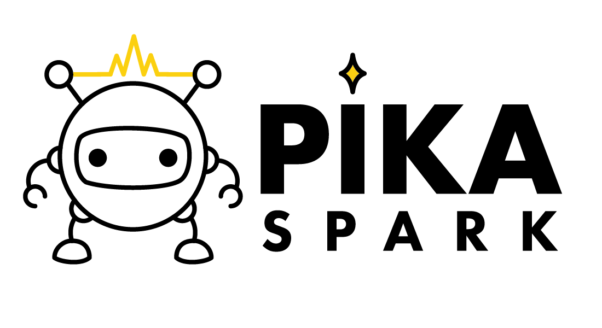

:sparkles: `.github`
====================

Repository containing default files for all [Pika Spark](https://pika-spark.io/) related repositories.

  

All artwork is copyright © [LXRobotics GmbH](https://www.lxrobotics.com/). All rights reserved.
